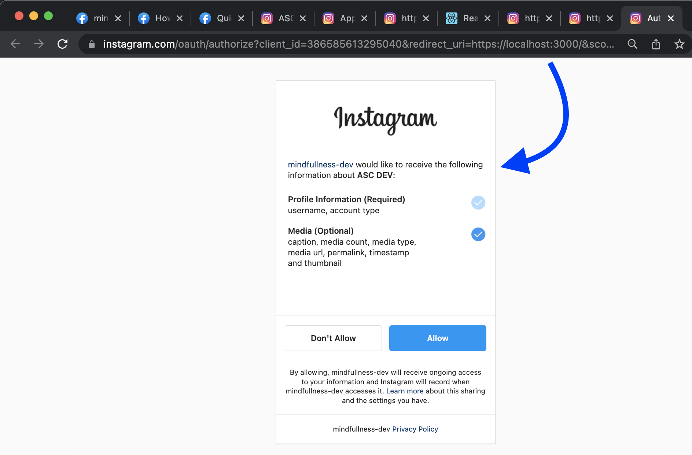
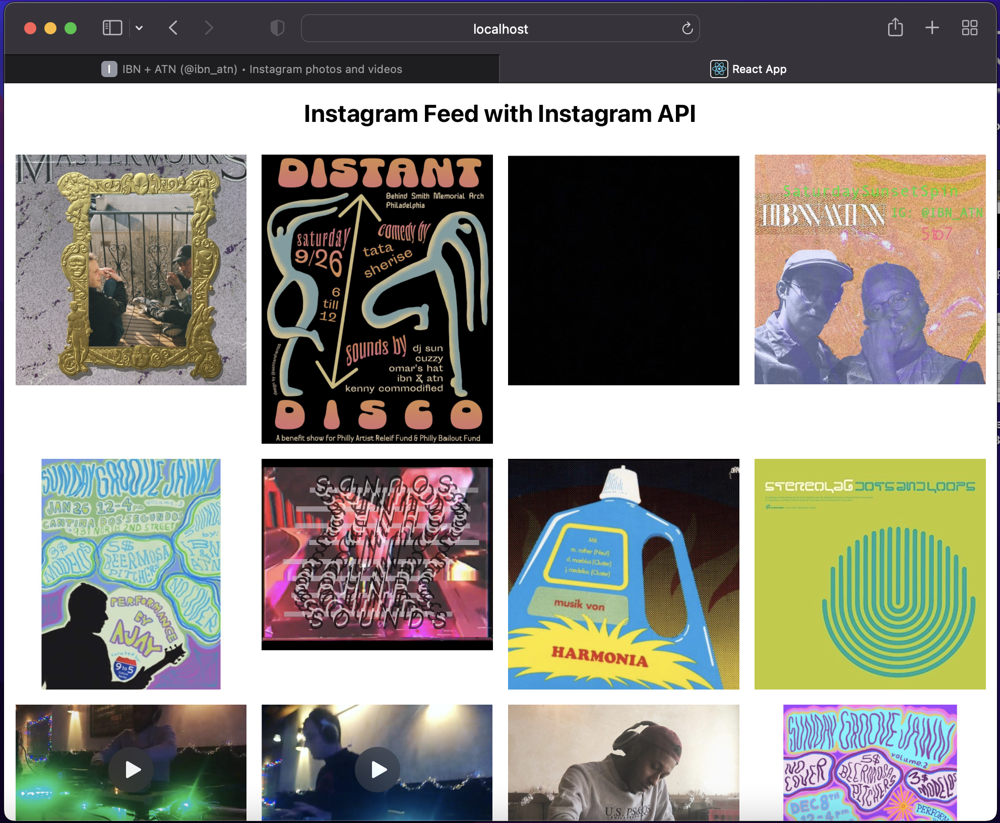

# Sample Web App for Instagram Basic API (Mindfullness Project Dev)

- Author: [Etienne Jacquot](mailto:etiennej@upenn.edu) 03/17/2022

## Getting Started

- **Official Meta Developer Guide for Getting Started here**: https://developers.facebook.com/docs/instagram-basic-display-api/getting-started


    - (Optional but also helpful) Look at references for **Instagram Basic API** integration for a web page, there is one described in a Medium tutorial in [Part 1](https://cming0721.medium.com/instagram-feeds-with-instagram-api-part-1-create-app-and-token-4a91ee3bd154) and [Part 2](https://cming0721.medium.com/instagram-feeds-with-instagram-api-part-2-basic-display-api-with-react-f0c6dfcc576c)

______

### Preliminary Meta Developer Setup

> Basically this includes Meta official guide [Steps 1-3](https://developers.facebook.com/docs/instagram-basic-display-api/getting-started#step-1--create-a-facebook-app)

- Setup an account for Instagram, Meta Developer, & have just some HTTPS site (either publicly hosted or localhost for quick test & dev)

- Create a Meta Developer App and link the Instagram Basic API

- Link Instagram Tester account

- Add the callback HTTPS URL

______

### Using Docker Compose for http://localhost:3000/ testing??

- Sample from https://github.com/docker/awesome-compose/tree/master/react-express-mongodb 
    - suggests a **React** & NodeJS + MongoDB or Rust + PostgreSQL... we will try the former


- Run locally:

    ```bash
    cd react-express-mongodb

    mkdir data # for volume mounted bind

    docker compose up -d
    ```
    - checkout http://localhost:3000/ for the sample docker-compose awesome template. we just need this running locally to test the oauth!

_______

### Try the URL try the instagram API URL

> This is [Step 4](https://developers.facebook.com/docs/instagram-basic-display-api/getting-started#step-4--authenticate-the-test-user) on the official Meta guide

- This is for your specific `app_id` for the Facebook developer app you created (`386585613295040`) and the specific callback HTTPS URL you specified (with a trailing slash I think and for testing purposes you don't need to actually setup SSL to confirm the oauth authorization functionality, https://localhost:3000/)

- ⭐ 👉 **Refresh - localhost docker app for callback url** --> https://instagram.com/oauth/authorize?client_id=386585613295040&redirect_uri=https://localhost:3000/&scope=user_profile,user_media&response_type=code

        - Nice! this actually shows the oauth for my logged in **instagram tester account** in my browser!

        

    - If you click to accept and **Allow**, the redirection obviously fails for SSL but if you click again for HTTP, it just loads but GETS the `code=` included in the URL, remove trailing `#_`  at:
        - http://localhost:3000/?code=AQCS5X_wXts8_1zfAgPtoEV_5Jb1vD1Wo7x7fI.............ytbb9fHHHwb07oMR3F47uwTWjKoeVjZKydOKEjWx-FbPrw#_
        > The token expires after 1 hour, click the URL again to get a new one. Careful not to share as it does provide temporary access to the instagram tester account, it will say "you previous connected...."


_________

### Exchange for a token (short-lived)

> This is [Step 5](https://developers.facebook.com/docs/instagram-basic-display-api/getting-started#step-5--exchange-the-code-for-a-token) on the official Meta Guide

- Run the following in terminal now that we have an authorization code for our testing instagram account
    - Replace for you `app-id`, `app-secret`, the local `redirect-uri`, and `code` from the callback above
    > *Be careful with the short lived code, and especially the app secret!*

    ```bash
    $ curl -X POST \
    https://api.instagram.com/oauth/access_token \
    -F client_id=386585613295040 \
    -F client_secret=199b7d714...33b7e8371 \
    -F grant_type=authorization_code \
    -F redirect_uri=https://localhost:3000/ \
    -F code=AQAxeajVS_Kb-JvXC77MUrGnGVDHUbciq1f6_71QAYfHSZb57-B4h8c209sb2YXbSqP8C-_MjggxMVRAZbE6uqgAqjuxODj...d66KE3QDJg1ebI2V_yJi9jXcaTOm2m3PF1x_FQ
    ```
    
    - this returns a json encoded object such as `access_token` & `user_id`
    
        ```json
        {"access_token": "IGQVJXWG9Pam8zNTlzWnlLekFMS1VQamZAub1NSdFhHZA25C..........ZA21Va2FOMGlSb3IzUlZAWQk92ZAmRWZAXVzaDNF", "user_id": 17841422579570037}
        ```

        - Excellent, with that token I think you can now use API calls

#### (OPTIONAL) Get a long term access token

- A long term access token lasts for 60 days, and is helpful if you want to include in the example instafeed app in Docker [react-express-mongodb/frontend-insta/](./react-express-mongodb/frontend-insta/) based on the template from part 2 on Github here: [https://github.com/MingSheng92/react_isntafeed](https://github.com/MingSheng92/react_isntafeed)

- Run the following using the previous `access_token` returned 

    ```bash
    $ curl -X GET  "https://graph.instagram.com/access_token?grant_type=ig_exchange_token&client_secret=199b7d714d33010416ec76e33b7e8371&access_token=IGQVJXeW5rb3Myel9JRjB0dWQwNWswSjZA3WE1VRkV......3B0bHhEOG55d1BuSThQMHIxalNMNllsWlI4QlRiOUhUc285eEhsVEVmRzJLazNF"
    ```

    - The `access_token` that is returned is your long ter 60 days! Keep this safe as it provides basic API access for your tester account! Should also have `,"token_type":"bearer","expires_in":5183986}`

> Note: you can save the long term bearer_token to your .env file configuration I think? [react-express-mongodb/frontend-insta/.env](./react-express-mongodb/frontend-insta/.env)
________

### Query the User Node

> This is [Step 6](https://developers.facebook.com/docs/instagram-basic-display-api/getting-started#step-6--query-the-user-node) of the official Meta guide, and really the conclusion of part 1 of that Medium tutorial (in the next sections we will incorporate into the React NodeJS frontend MongoDB NoSQL backend)

- Finally, you can query the User node (later sections on the media node...)
    - this is for the `account_token` and `user_id`... 
    - more info on fields here, only `id` and `username` apply for the **User node**: https://developers.facebook.com/docs/instagram-basic-display-api/reference/media/

    ```bash
    $ curl -X GET \
    'https://graph.instagram.com/17841422579570037?fields=id,username&access_token=IGQVJXWG9Pam8zNTlzWnlLekFMS1VQamZAub1NSdFhHZA2........GVFRVZAnZA21Va2FOMGlSb3IzUlZAWQk92ZAmRWZAXVzaDNF'
    ```

    - This returns simply the user (the tester account) info as json encoded object, valid through the allowed oauth

        ```json
        {"id":"5006615216052169","username":"ascdev3620"}
        ```
__________

### Querying user media

- There are examples for the Media on the Meta official guide here: https://developers.facebook.com/docs/instagram-basic-display-api/guides/getting-profiles-and-media#get-a-user-s-media

- run the following (remember you may need to re-allow)

    ```bash
    $ curl -X GET \
        'https://graph.instagram.com/me/media?fields=id,caption&access_token=IGQVJYOFE1dHdtcTJUN25XbHRGM2hFYjRnRzVCZAXJ2dV9XeXpweDgzbll6WHJ6Q1..........b2sxV1FWTGh4YWswMXlJS0NJYWZAYcHlv'
    ```
    - this returns a json encoded object for the User's media posts (my tester account only has one user!)

        ```json
        {"data":[{"id":"18110789671048314","caption":"THIS IS A TEST CAPTION! \ud83e\udde0\ud83e\udde0\ud83e\udde0"}],"paging":{"cursors":{"before":"QVFIUkdvVHo3SUM2aUxwcjJkWGpmLTBhTU43aVRHMVFKNG5DSFJrWTRTOHd5enRLd0dpTG5ZAV3plM3pfcGJkOU5KMDdXcFpUYjlEVXR6ZAHV1bzJRWXdXT1Bn","after":"QVFIUkdvVHo3SUM2aUxwcjJkWGpmLTBhTU43aVRHMVFKNG5DSFJrWTRTOHd5enRLd0dpTG5ZAV3plM3pfcGJkOU5KMDdXcFpUYjlEVXR6ZAHV1bzJRWXdXT1Bn"}}}
        ``` 
        - There are media fields

### Query a specific edge node for Media ID

- run the following to get the media info using the `media_id` returned above

    - media fields here: https://developers.facebook.com/docs/instagram-basic-display-api/reference/media#fields

    ```bash
    $ curl -X GET \
    'https://graph.instagram.com/18110789671048314?fields=id,media_type,media_url,permalink,username,timestamp&access_token=IGQVJYOFE1dHdtcTJUN25XbHRGM2hFYjRnRzVCZAXJ2dV9XeXpweD.......WTGh4YWswMXlJS0NJYWZAYcHlv'
    ```

    - This gets the media post information:

        ```json
        {"id":"18110789671048314","media_type":"IMAGE","media_url":"https:\/\/scontent-iad3-1.cdninstagram.com\/v\/t51.2885-15\/74920846_699184833934985_7840966360268957757_n.jpg?_nc_cat=103&ccb=1-5&_nc_sid=8ae9d6&_nc_ohc=727P9naTckIAX_7VcQJ&_nc_ht=scontent-iad3-1.cdninstagram.com&edm=ANQ71j8EAAAA&oh=00_AT9ycctTcMd_Wxtx-JLrG-fP7j0yVHrW-rDfUAmYDbxJHw&oe=6239EEE2","permalink":"https:\/\/www.instagram.com\/p\/B38VAzjgn2a\/","username":"ascdev3620","timestamp":"2019-10-23T01:40:58+0000"}
        ```

        - we now have a `permalink` for the image post, this is https://www.instagram.com/p/B38VAzjgn2a/
        - the `media_url` is different, needs to be properly formatted to get the image, change `\/` to `/` and this works on Instagram CDN: [https://scontent-iad3-1.cdninstagram.com/v/t51.2885-15/74920846_699184833934985_7840966360268957757_n.jpg?_nc_cat=103&ccb=1-5&_nc_sid=8ae9d6&_nc_ohc=727P9naTckIAX_7VcQJ&_nc_ht=scontent-iad3-1.cdninstagram.com&edm=ANQ71j8EAAAA&oh=00_AT9ycctTcMd_Wxtx-JLrG-fP7j0yVHrW-rDfUAmYDbxJHw&oe=6239EEE2](https://scontent-iad3-1.cdninstagram.com/v/t51.2885-15/74920846_699184833934985_7840966360268957757_n.jpg?_nc_cat=103&ccb=1-5&_nc_sid=8ae9d6&_nc_ohc=727P9naTckIAX_7VcQJ&_nc_ht=scontent-iad3-1.cdninstagram.com&edm=ANQ71j8EAAAA&oh=00_AT9ycctTcMd_Wxtx-JLrG-fP7j0yVHrW-rDfUAmYDbxJHw&oe=6239EEE2).
            > We can do whatever with the image, like save locally, save in mongodb, run AWS rekognition for image detection, post in a timeline, try and setup some mindfullness app for positive photos from your peers, etc.. 

______

### Incorporating the React Instafeed example from Medium Part 2.

- I cloned the repo and renamed as **react-express-mongodb/frontend-insta**, edited the docker-compose to reflect the new frontend container name...

- Get a shoet term / long term access token and save in `.env` for frontend-insta and docker compose build... 

    - *This will pull all the posts from the user and display in a simple React web page!!* If you hover over the images they kind of expand in size...
        - I could totally see something where the mindfull waves show up for pictures as a nice visual...
        - docker-composed and manually sets env token... could you have the app prompt users for oauth, route back to same page and dynamically set the token in the env? That would be a nice experience right?!
        - Can also see where the moment the images are pulled, we pass each img semi-perma URL to azure / aws for image recognition or even classification if we trained a mindfullness model or something .. then each image in the feed could get a *mindfulness* rating or something.. similar to TimeHop app the MindHop will show you old photos that get a classification based on some self-reported statement or pre determined something ... 

    - [http://localhost:3000/](http://localhost:3000/)

    


__________

### NEXT STEPS

- Storing returned api info into the MongoDB backend on docker-compose, to have persistent data? 
    - We want to collect image urls I think or does this only get processed on accessing & allowing?
    - In my ML class we talked about [GDRP Article 25](https://gdpr-info.eu/art-25-gdpr/) in reference to *Data protection by design and by default* and specifically principlpes like **data minimisation**! 

- Update the nodejs express frontend for react web app to display the returned IG data... 

- Do we want a backend of Flask or Express? I am more comfortable of course with Python than JavaScript?

- Simple LetsEncrypt SSL for redirection for https:localhost (helpful for testing the following item)

- Instagram oAuth short term access token set as .venv all in one
    1. /welcome page with button to click to allow access
    2. redirection
    3. user allows, json access token returned, set as env variable
    4. sends to /feed or something with the InstaFeed React page

- Simple incorporation of JS Azure Cognitive Service API call for images via url + Display in React app